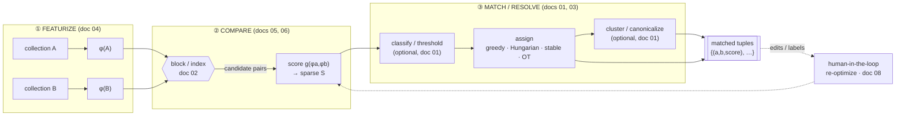

# The Matching Problem: A Canonical Taxonomy & Terminology

*Capstone map for the `equate` redesign — the index document for the corpus in
`docs/research/`. Read this first; every facet doc (`01`–`09`) drills into one
stage or concern named here, and `10-design-implications-for-equate.md` turns this
map into architecture.*

## Abstract

"Matching" has been re-invented under a dozen names — *entity resolution*,
*record linkage*, *data matching*, *deduplication*, *bipartite matching*,
*similarity search*, *schema matching*, *coreference resolution* — by communities
that rarely read each other. Underneath the vocabulary they solve **one abstract
problem**: given one or more collections of objects with *no reliable shared
identifier*, decide which objects *correspond*, and emit that correspondence as a
set of (possibly scored) tuples. This document establishes the canonical
decomposition of that problem into three composable stages — **featurize →
compare → match/resolve** — maps every community's vocabulary onto those stages,
enumerates the dimensions along which concrete matching tasks vary, and explains
the **equivalence-relation** framing that gives the `equate` project its name:
matching is *equality relaxed into a graded, learned, often intransitive
correspondence*. It closes with a consolidated glossary and a pipeline diagram
that the rest of the corpus refines.

The single most important idea: **`equate` is not equality.** `==` is the
degenerate case where featurization is the identity, comparison is `a == b`, and
matching is `groupby`. Everything else in the field is what you get by relaxing
one of those three axes.

---

## 1. The canonical decomposition

Almost every matching system in every community factors into the same three
stages. We name them with the user's mental model first, then the field-standard
term, then the Python idiom each generalizes.

| # | User's model | Field-standard name(s) | Generalizes the Python idiom | Facet doc |
|---|---|---|---|---|
| 1 | **Featurize** — map each object to a representative carrying the info needed to compare it | *representation, featurization, encoding, embedding, signature, blocking key* | `key=` in `sorted`/`min`/`max`/`groupby` — produce a comparable proxy | [`04`](04-featurization-and-representation.md) |
| 2 | **Compare** — score or decide how alike two representatives are | *similarity / distance function, comparison, scoring, comparison vector, match weight* | `==`, `<`, `key.__lt__` — widened from boolean to a graded score | [`05`](05-comparison-and-similarity-functions.md) |
| 3 | **Match / resolve** — turn the field of comparisons into a set of matched tuples | *matching, assignment, resolution, linkage, clustering, canonicalization* | `groupby` / `dict`-join — widened from exact bucketing to optimized correspondence | [`03`](03-assignment-and-graph-matching.md) |

### 1.1 The core triad

```
objects ──featurize──▶ representations ──compare──▶ score field ──match──▶ matched tuples
   A,B        φ              φ(A), φ(B)      g          S[i,j]     Σ        {(a,b,score), …}
```

**(a) Featurize (representation).** A featurizer `φ: Object → Representation` maps
each object to something comparable. The representation may be a fixed-length
**feature vector** or **embedding** (text → SBERT, image → CLIP, audio → CLAP), a
**set** of tokens/shingles, a **bit-string** (perceptual/acoustic hash), a
**scalar** or **structured/nested record** (per-field sub-representations), or —
in the degenerate case — the **identity function** `φ = id`, which recovers exact
matching. Crucially, `φ` obeys the same contract as a Python **key function**:
`key.lower`, `str`, `operator.attrgetter('name')` are all valid featurizers. See
[`04`](04-featurization-and-representation.md).

**(b) Compare (comparison / scoring).** A comparator `g: (Repr, Repr) → score`
returns a number (or a boolean, the 0/1 special case). Two structurally different
routes produce it:
- **Featurize-then-compare:** `score(a,b) = g(φ(a), φ(b))` with a *generic*
  metric `g` (cosine, Jaccard, Hamming, dot product) over precomputed
  representations. This is what `equate.similarity_matrix` does today (TF-IDF `φ`
  + `cosine_similarity` `g`).
- **Direct pairwise compare:** `score(a,b) = h(a,b)` where `h` is an *opaque*
  scorer that never factors through independent representations (edit distance,
  `difflib.SequenceMatcher.ratio`, a cross-encoder / LLM pair-prompt). This is
  what `equate.match_greedily` does today.

  The distinction matters downstream: only featurize-then-compare metrics are
  **indexable** (an ANN/LSH index can find neighbours without all-pairs work).
  Opaque scorers can only *re-rank a candidate set*. See
  [`05`](05-comparison-and-similarity-functions.md) and
  [`06`](06-deep-learning-and-llm-entity-matching.md).

**(c) Match / resolve.** A matcher `Σ` turns the score field `S` into a set of
matched tuples under a global objective and constraints (one-to-one, capacities,
thresholds). This is a *family* of algorithms, not one — greedy, optimal linear
assignment (Hungarian / Jonker-Volgenant), stable matching (Gale-Shapley),
maximum-weight/cardinality bipartite matching, soft/optimal-transport, and
clustering/transitive-closure. `equate/util.py` already ships five of these
behind a uniform `matcher(similarity_matrix) → (i,j)` signature. See
[`03`](03-assignment-and-graph-matching.md).

### 1.2 The expanded, field-standard pipeline

The three-stage triad is the *conceptual* core. Production entity-resolution
systems expand it into a **five-to-six stage end-to-end pipeline** by inserting a
scalability stage before comparison and splitting resolution into decision +
grouping [1,2,14]:

1. **Featurize / represent** — schema alignment + per-field representation.
2. **Block / index (candidate generation)** — cheaply propose *which pairs are
   worth comparing at all*, avoiding the O(n²) all-pairs blow-up. This is not a
   separate concern from "compute the similarity matrix" — **blocking is precisely
   the decision to leave most cells of that matrix uncomputed** (the sparse
   similarity matrix). See [`02`](02-blocking-and-scalable-candidate-generation.md).
3. **Compare / score** — build a per-pair **comparison vector** (one score per
   field) or a single similarity.
4. **Classify / decide (optional)** — map the comparison vector to
   match / non-match / *possible-match* (abstain). Home of the **Fellegi-Sunter**
   probabilistic model and supervised/active-learned classifiers. See
   [`01`](01-entity-resolution-record-linkage.md),
   [`08`](08-interactive-active-learning-and-hitl.md).
5. **Match / assign** — enforce global constraints (1:1 assignment, etc.).
6. **Cluster / canonicalize (resolution)** — take transitive closure /
   correlation-cluster pairwise links into entity groups, then merge each group
   into a **golden record**. See [`01`](01-entity-resolution-record-linkage.md).

The triad and the pipeline are the same thing at two resolutions: **block** is an
optimization *inside* compare (skip cells), **classify** and **cluster** are
refinements *inside* match/resolve. `equate` should model the triad as the stable
public API and expose the extra stages as optional, injectable refinements
(see [`10`](10-design-implications-for-equate.md)).



---

## 2. The synonyms table (user vocabulary → each community)

The same operation, and the same three stages, appear under different names in
each field. This is the Rosetta table a unifying framework needs [1,7,9].

### 2.1 The whole operation

| `equate` / user term | Databases | Statistics / epidemiology | NLP | Semantic web | Industry / MDM | Vector search / ML |
|---|---|---|---|---|---|---|
| **match** (the operation) | entity resolution, deduplication, merge/purge | record linkage | coreference resolution, entity linking | instance matching, link discovery, reference reconciliation | identity resolution, householding | similarity search, retrieval |
| **match within one collection** | deduplication, duplicate detection | internal linkage | — | — | list washing | near-duplicate detection |
| **match across two collections** | record linkage, data matching | linkage | entity linking (to KB) | `owl:sameAs` minting | data onboarding | cross-encoder retrieval |
| **matched group / entity** | cluster, golden record | matched set | coreference chain | resolved entity | golden record, single view | cluster |

### 2.2 Per stage

| Stage | Databases / ER | Statistics | Vector search | Schema/data-lake (doc 07) |
|---|---|---|---|---|
| **① Featurize** | attribute standardization, feature vector | comparison configuration | embedding, encoding | column signature, value-set, distribution |
| **② Block** | blocking, indexing, filtering | blocking | ANN retrieval, candidate generation | LSH-Ensemble, JOSIE inverted index |
| **② Compare** | comparison, string similarity | agreement pattern, m/u | cosine / dot-product score | Jaccard, containment, distribution divergence |
| **② Classify** | match/non-match/possible-match | Fellegi-Sunter decision rule | threshold | correspondence selection |
| **③ Match** | matching, assignment | linkage decision | top-k assignment | 1:1 / many-to-many correspondence |
| **③ Cluster** | ER clustering, canonicalization | — | community detection | — |

**Design consequence** (echoed across [`01`](01-entity-resolution-record-linkage.md),
[`04`](04-featurization-and-representation.md),
[`09`](09-python-ecosystem-landscape.md)): adopt the field's vocabulary as the
public API surface and ship this synonyms table as a glossary, so a statistician
reaching for `m-probability`, an engineer reaching for `blocking`, and an
ML practitioner reaching for `ANN retrieval` all find the same seam.

---

## 3. The dimensions along which matching problems vary

A concrete matching task is a *point* in a multi-dimensional space. `equate`'s job
is to make the **common point** trivial and the **rest of the space** reachable by
turning a parameter, not rewriting code. The axes:

### 3.1 Output cardinality — 1:1 vs 1:n vs n:m
- **1:1 (bijective / injective assignment):** each object matches at most one
  other; "never reuse a value." This is the **linear assignment problem**;
  `equate`'s `match_greedily` (remove matched value) and `hungarian_matching`
  enforce it. Solved optimally in O(n³) by Hungarian/Jonker-Volgenant [3].
- **1:n (one-to-many / link-to-KB):** each query object maps to its *best* (or
  top-k) targets; targets may be reused. Entity **linking** to a knowledge base is
  1:n. This is just **top-k retrieval per row** — no global constraint.
- **n:m (many-to-many / capacitated):** objects on both sides may participate in
  several matches, possibly under capacities. Polynomial via min-cost flow if
  uncapacitated; **NP-hard** (Generalized Assignment Problem) with knapsack
  capacities [3]. Schema matching returns n:m correspondence *sets*
  ([`07`](07-schema-and-ontology-matching.md)).

### 3.2 Scored vs boolean output
Does the match carry a **score/probability**, or is it a hard yes/no? Booleans are
the special case of scores after a **threshold**. Interactive review and
re-optimization *require* the score (ideally calibrated to a probability) to be
retained ([`08`](08-interactive-active-learning-and-hitl.md)).

### 3.3 k-best / top-k retained per item
Keep only the single best match, or the **top-k candidates with scores** per
object? Retaining top-k is the enabling substrate for human verification,
re-ranking cascades, and interactive re-optimization
([`06`](06-deep-learning-and-llm-entity-matching.md),
[`08`](08-interactive-active-learning-and-hitl.md)).

### 3.4 Single vs multiple output matchings
One matching, or an **enumeration of alternative matchings** in decreasing quality
(the *k-best assignments* problem, solved by **Murty's algorithm** [3,8])? The
latter powers "show me the next-best global solution" after a user rejects an edge.

### 3.5 Partial matching (unmatched items allowed)
Must every object match (a *full* / *perfect* matching), or may objects be left
**unmatched** because nothing clears a `minimum_score`? Partiality is modelled
*inside* the optimizer (rectangular padding, dummy nodes, forbidden edges,
`minimum_score`), not by post-filtering — otherwise the global optimum is wrong
([`03`](03-assignment-and-graph-matching.md)). `match_greedily`'s `minimum_score`
is a first taste of this.

### 3.6 Pairwise vs global / collective
- **Pairwise (independent):** each pair scored and decided in isolation.
- **Global / collective / relational:** decisions interact — a 1:1 constraint
  couples all pairs (assignment); **collective ER** propagates match decisions
  through an entity graph; LLM "select-from-candidates" reasons over a whole
  candidate set at once [6]. Global consistency is enforced in the match stage,
  decoupled from scoring.

### 3.7 Exact vs approximate
- **Exact:** every candidate pair is truly scored; the optimizer returns the
  provable optimum. Feasible only at small scale or after blocking.
- **Approximate:** blocking/ANN may *miss* true pairs (recall < 1); Sinkhorn OT
  returns an ε-approximate plan; greedy assignment is order-dependent and
  sub-optimal. Approximation is the price of scale
  ([`02`](02-blocking-and-scalable-candidate-generation.md)).

### 3.8 Batch vs incremental / online
Resolve a fixed pair of collections once (**batch**), or maintain a matching as
objects **stream in / change** (incremental / online / evolving ER)? Incremental
methods re-resolve only the *affected* block/component rather than recomputing
globally; interactive editing is a special case
([`08`](08-interactive-active-learning-and-hitl.md)).

| Axis | Cheap default `equate` should ship | Reachable by a parameter/strategy |
|---|---|---|
| Cardinality | 1:1 assignment | 1:n top-k, n:m flow/OT |
| Score vs boolean | scored (retain float) | `threshold=` → boolean |
| Top-k | k=1 | `k=` retained candidates |
| # matchings | 1 | Murty `k_best=` |
| Partial | full | `minimum_score=` / dummy nodes |
| Locality | pairwise → global 1:1 | collective / clustering strategy |
| Exactness | exact (all-pairs) | blocker / ANN strategy |
| Time | batch | incremental re-solve on edit |

---

## 4. The equivalence-relation framing (why "equate" is not equality)

The project is named **`equate`**, not `equals`, on purpose. Matching is what you
get by **relaxing the equality relation** along a spectrum.

### 4.1 From equality to graded correspondence
Exact equality `==` is an **equivalence relation**: reflexive, symmetric,
transitive. It partitions a set into equivalence classes — which is exactly what
`itertools.groupby(key)` or a `dict` bucketing computes. Matching *relaxes* this:

- **Relax the representation** (featurize): group by `str.lower`, by a rounded
  value, by a token set → still an equivalence relation, still transitive, but
  now over a *coarser* key. This is "matching by a key function."
- **Relax the comparison** (grade it): replace the boolean `a == b` with a graded
  `sim(a,b) ∈ [0,1]`. Now "match?" is `sim ≥ θ` — and this relation is **no longer
  transitive**: `a≈b` and `b≈c` do *not* imply `a≈c`. This is the crux.

### 4.2 Transitive closure and clustering
To recover *groups* (entities, clusters, golden records) from intransitive
pairwise "≈" links, you must impose transitivity **by choice**: compute the
**transitive closure** of the match graph — its **connected components** (union-find)
— to force an equivalence relation back onto the data [1,14]. This is the
resolution/clustering stage.

### 4.3 When to enforce transitivity — and when not to
Enforcing transitivity is a *modelling decision with a known failure mode*:

- **Enforce it** when the ground truth really is a partition into disjoint
  entities (dedup: every record is exactly one real person) and you want a single
  canonical group per entity.
- **Do NOT enforce it blindly.** Transitive closure is fragile: **one spurious
  edge can collapse two genuinely distinct entities** into one giant component
  ("entity collapse") [1,14]. Robust alternatives *soften* transitivity:
  **correlation clustering** (minimize disagreements, tolerating some intra-cluster
  non-edges and inter-cluster edges), hierarchical/MCL clustering, or leaving the
  output as *pairwise* links with no closure at all.
- **Never enforce it** for genuine 1:n or n:m tasks (link-to-KB, schema
  correspondence), where the relation is not even meant to be an equivalence.

**Design consequence:** clustering/canonicalization must be a **separate,
swappable strategy** with an explicit default (connected-components for
simplicity) and a documented escape hatch (correlation clustering for
robustness); `equate` must never hard-wire transitive closure into the matcher
([`01`](01-entity-resolution-record-linkage.md),
[`10`](10-design-implications-for-equate.md)). The one-to-one assignment matchers
(`hungarian_matching` etc.) enforce a *different* structure — a **bipartite
partial matching**, which is not an equivalence relation at all — underscoring
that "match" spans several distinct output algebras.

---

## 5. Consolidated glossary

Term → definition → cross-community synonyms. (Stage tags: ①featurize ②compare
③match.)

| Term | Definition | Synonyms / notes |
|---|---|---|
| **Entity resolution (ER)** | Deciding which records refer to the same real-world entity absent a shared key; the umbrella term for the whole pipeline. | record linkage, data matching, deduplication, merge/purge, reference reconciliation, coreference resolution [1] |
| **Record linkage** | Cross-source ER; classically the statistical two-clean-sources setting. | linkage; deterministic vs probabilistic [1] |
| **Deduplication** | Single-source ER: finding duplicates *within* one dataset. | dedup, duplicate detection [1] |
| **Entity linking / disambiguation** | Linking a mention to a canonical KB entry — a **1:n** variant. | entity linking, instance matching [1] |
| **① Featurizer (φ)** | Map an object to a comparable representation. | representation, encoder, embedder, key function, signature [4] |
| **① Feature vector / embedding** | Fixed-length numeric representation; dense (SBERT/CLIP/CLAP) or sparse (TF-IDF). | vector, encoding [4] |
| **① Comparison vector** | Per-field vector of similarities for one candidate pair. | agreement pattern, feature vector [1,5] |
| **① Blocking key / predicate** | A cheap key whose collisions define candidate pairs. | blocking predicate, sort key [2] |
| **② Similarity / distance function** | Graded comparison of two representations. | metric, comparator, scorer, kernel [5] |
| **② Metric vs non-metric** | A metric obeys identity/symmetry/triangle-inequality; cosine is a *similarity*, not a metric. | angular distance is the metric form [4,5] |
| **② Fellegi-Sunter model** | Probabilistic classifier: sum of per-field `log(m/u)` match weights vs two thresholds. | m-probability, u-probability, match weight [1,5] |
| **② m-probability / u-probability** | `P(field agrees \| match)` and `P(field agrees \| non-match)`. | EM-estimable unsupervised [1] |
| **② Match weight / likelihood ratio** | `log(m/u)` per field; sum is the total score (Bayes factor). | log-odds, Fellegi-Sunter weight [1,5] |
| **② Bi-encoder vs cross-encoder** | Encode objects independently (indexable) vs jointly score a pair (accurate, not indexable). | dual-encoder/two-tower vs interaction model [6] |
| **② Blocking / indexing / filtering** | Cheaply generate candidate pairs to dodge O(n²). | candidate generation, ANN retrieval [2] |
| **② Meta-blocking** | Prune a weighted blocking graph to raise precision of candidate set. | block cleaning, comparison propagation [2] |
| **② LSH / MinHash / SimHash** | Locality-sensitive hashing: hash so that similar items collide (Jaccard / cosine). | banding, sketches [2,4] |
| **② ANN (HNSW, IVF-PQ, ScaNN)** | Approximate nearest-neighbour vector search. | vector index, dense blocking [2,4] |
| **② Reduction ratio (RR)** | `1 − |candidates|/|all pairs|`; how much blocking pruned. | efficiency metric [2] |
| **② Pair completeness (PC)** | `|true pairs kept|/|true pairs|` — blocking **recall**; upper-bounds system recall. | recall of blocking [2] |
| **② Pairs quality (PQ)** | `|true pairs kept|/|candidates|` — blocking **precision**. | precision of blocking [2] |
| **③ Matching / assignment** | Turn the score field into matched tuples under global constraints. | linkage decision, resolution [3] |
| **③ Linear assignment problem (LAP)** | Min-cost 1:1 correspondence; O(n³) via Hungarian/Jonker-Volgenant. | LSAP, optimal assignment [3] |
| **③ Hungarian / Kuhn-Munkres** | Classical O(n³) exact LAP solver. | Munkres [3] |
| **③ Jonker-Volgenant (JV/LAPJV)** | Same bound as Hungarian, ~10× faster in practice; `scipy.linear_sum_assignment`. | shortest-augmenting-path [3] |
| **③ Stable matching (Gale-Shapley)** | Matching with no blocking pair; optimizes **stability, not total score**; proposer-optimal. | deferred acceptance, stable marriage [3] |
| **③ Optimal transport / Sinkhorn** | **Soft/fractional** matching: a transport plan, not a 0/1 assignment. | Wasserstein, EMD, entropic OT [3] |
| **③ Murty's algorithm** | Enumerate the k best assignments in increasing cost. | k-best assignment, ranked assignment [3,8] |
| **③ Transitive closure / connected components** | Force pairwise "≈" links into disjoint entity groups. | union-find, clustering [1] |
| **③ Correlation clustering** | Cluster to minimize edge disagreements; robust alternative to closure. | constrained clustering [1,8] |
| **③ Canonicalization / golden record** | Merge a cluster into one representative record. | merging, single view, MDM [1] |
| **③ B-Cubed (B³)** | Cluster-level precision/recall/F1 computed per record. | cluster evaluation metric [1] |
| **Active learning** | Iteratively query a human/oracle for the *most informative* labels. | uncertainty sampling, query-by-committee [8] |
| **Human-in-the-loop (HITL)** | Human labels/verifies/edits within the loop; vs human-on-the-loop (oversight only). | clerical review, verification [8] |
| **Schema / ontology matching** | Match **columns/attributes** (not rows) across tables/ontologies. | attribute matching, join-key discovery [7] |
| **Set containment vs Jaccard** | `|Q∩X|/|Q|` (asymmetric, size-robust) vs `|Q∩X|/|Q∪X|` (symmetric). | containment for skewed sizes [7] |

---

## 6. How the corpus maps onto this taxonomy

| Facet doc | Stage / concern it deepens |
|---|---|
| [`01` Entity Resolution & Record Linkage](01-entity-resolution-record-linkage.md) | The whole pipeline; Fellegi-Sunter; clustering/canonicalization; evaluation |
| [`02` Blocking & Candidate Generation](02-blocking-and-scalable-candidate-generation.md) | ② the scalability sub-stage: blocking, LSH, ANN, meta-blocking |
| [`03` Assignment & Graph Matching](03-assignment-and-graph-matching.md) | ③ the optimization layer: LAP, stable, OT, Murty k-best |
| [`04` Featurization & Representation](04-featurization-and-representation.md) | ① representation: embeddings, hashes, key-function contract |
| [`05` Comparison & Similarity Functions](05-comparison-and-similarity-functions.md) | ② comparators: string/token/phonetic/numeric/geo, calibration |
| [`06` Deep Learning & LLM Matching](06-deep-learning-and-llm-entity-matching.md) | ②/③ learned scorers: bi-/cross-encoders, LLM match/compare/select, cascades |
| [`07` Schema & Ontology Matching](07-schema-and-ontology-matching.md) | The "objects = columns" instantiation; join-key discovery; COMA combination |
| [`08` Interactive, Active Learning & HITL](08-interactive-active-learning-and-hitl.md) | The loops: active learning, review, interactive re-optimization |
| [`09` Python Ecosystem Landscape](09-python-ecosystem-landscape.md) | What to wrap vs reimplement per stage; licences; layered protocols |
| [`10` Design Implications for equate](10-design-implications-for-equate.md) | The synthesis → concrete architecture |

---

## Extended vocabulary (round-2 additions)

Terms the round-1 glossary omitted, added once the round-2 facet docs (`12`–`18`)
brought their communities into scope. Same house style — term → definition →
synonyms / **where-covered** (linking the round-2 doc that treats it in depth).
(Stage tags: ①featurize ②compare ③match; **fuse** = the post-③
canonicalization stage of [`16`](16-data-fusion-and-canonicalization.md).)

| Term | Definition | Synonyms / where-covered |
|---|---|---|
| **fuse Truth discovery** | Jointly infer per-source **reliability** and the **true value** from conflicting multi-source data, by mutual reinforcement between source trust and value belief (TruthFinder, Dawid–Skene, LTM, Accu, CRH). | source-quality-aware fusion, latent-truth model — [`16`](16-data-fusion-and-canonicalization.md) |
| **fuse Data fusion** | Merge the records of one resolved entity into a single complete/concise/consistent representation (the DB community's golden-record step); conflict-*ignoring* / *avoiding* / *resolving* strategies with pluggable resolution functions (vote, max, most-recent, coalesce). | conflict resolution, the "fuse" stage after ③ — [`16`](16-data-fusion-and-canonicalization.md) |
| **fuse Survivorship / master data management (MDM)** | MDM: the governance + technology discipline that builds and maintains **golden records** for core enterprise entities. Survivorship: the per-attribute rule deciding which source value "survives" into the golden record (provenance/lineage is its prerequisite). | single version of truth, single customer view — [`16`](16-data-fusion-and-canonicalization.md) |
| **② Dynamic time warping (DTW) & soft-DTW** | DTW: elastic alignment of two real-valued sequences via a minimum-cost **monotone warping path** (O(nm), *not* a metric; Sakoe-Chiba band regularizes). Soft-DTW: differentiable soft-min over all alignments — a *learnable loss*, not a distance (can be negative). | elastic sequence distance; opaque **direct** comparator (not ANN-indexable) — [`12`](12-sequence-and-graph-structure-matching.md) |
| **② Needleman-Wunsch / Smith-Waterman alignment** | Biosequence dynamic-programming alignment sharing the edit-distance-with-traceback template: **Needleman-Wunsch** is global (whole-vs-whole), **Smith-Waterman** is local (best sub-region pair); both O(nm) with an injectable substitution matrix + affine-gap scoring. | global / local sequence alignment — [`12`](12-sequence-and-graph-structure-matching.md) |
| **② Graph edit distance (GED)** | Min-cost sequence of node/edge insert/delete/substitute edits transforming one graph into another; NP-hard, with a **bipartite (Riesen-Bunke) approximation** that reduces it to a LAP. | structural edit distance — [`12`](12-sequence-and-graph-structure-matching.md) |
| **③ Network / graph alignment** | Find a **node correspondence** between two graphs that preserves structure — the graph analogue of entity resolution; formally a **Quadratic Assignment Problem (QAP)** whose costs depend on *pairs* of assignments (edge preservation). Spectral/consistency (IsoRank, FINAL), embedding (REGAL, CONE-Align), and GNN methods. | graph matching, node alignment — [`12`](12-sequence-and-graph-structure-matching.md) |
| **① Weisfeiler-Lehman (WL) kernel** | A **graph kernel** mapping a graph to a feature vector by iterative neighbor-label hashing — restoring the indexable featurize-then-compare path for graphs; linear in edges × iterations; bounds GNN expressivity. | graph kernel, color refinement — [`12`](12-sequence-and-graph-structure-matching.md) |
| **③ Knowledge-graph entity alignment (EA)** | Seed-supervised, GNN/embedding matching of **equivalent entities across two knowledge graphs** (e.g. RREA). | KG entity alignment, instance matching across KGs — [`12`](12-sequence-and-graph-structure-matching.md) (benchmarked by OpenEA in [`14`](14-evaluation-benchmarks-and-methodology.md)) |
| **① Privacy-preserving record linkage (PPRL) & Bloom-filter encoding** | PPRL: link records across parties **without revealing raw quasi-identifiers** (only matched id-pairs are learned). Bloom-filter encoding / **CLK**: hash identifier q-grams into a bit array so the Dice coefficient of bit vectors approximates string similarity — *fuzzy* matching on encoded data (needs **hardening**; not cryptographically secure). | anonymous linkage, cryptographic long-term key — [`18`](18-frontiers-pprl-fairness-geospatial.md) |
| **② Blocking-scheme learning** | Automatically **learn** the blocking predicates/keys instead of hand-crafting them: supervised learning of a disjunction of {attribute, similarity-predicate} that covers true pairs while minimizing candidate volume, or self-supervised deep blocking (e.g. Zingg learns a blocking model). | learned blocking, learned candidate generation — [`17`](17-vector-databases-and-scale-out.md) (DeepBlocker in [`02`](02-blocking-and-scalable-candidate-generation.md)) |
| **Temporal / evolving ER** | ER that accounts for entity attributes **drifting over time** via time-aware comparison; the incremental/streaming variant re-resolves only *affected* clusters as data changes. | time-aware ER, entity evolution — [`15`](15-collective-incremental-and-bayesian-er.md) |
| **③ Collective / relational ER** | Resolve co-occurring references **together**, propagating match evidence through a graph of relationships rather than scoring pairs independently (relational clustering RC-ER, Markov Logic Networks, PSL/HL-MRF). | joint ER, relational clustering — [`15`](15-collective-incremental-and-bayesian-er.md) (the global/collective axis of §3.6) |
| **Bayesian entity resolution** | Infer a **posterior distribution over partitions** of records into entities — calibrated uncertainty, not a single matching — via a generative *linkage-structure* model with a bipartite/partition prior (blink, d-blink). | graphical record linkage, posterior partition uncertainty — [`15`](15-collective-incremental-and-bayesian-er.md) |
| **③ Cross-modal matching / Gromov-Wasserstein** | Match objects across **incomparable** spaces/modalities using only *intra-set* distances — **Gromov-Wasserstein** optimal transport, the soft cross-space network-alignment objective; the basis for aligning items lacking a shared metric/embedding. | cross-space alignment, GW-OT — [`12`](12-sequence-and-graph-structure-matching.md) (multimodal embeddings in [`17`](17-vector-databases-and-scale-out.md)) |
| **② Vector database (as blocking backend)** | A persistent service/library storing vectors + metadata and serving ANN queries with CRUD, metadata filtering, and hybrid search — used as the **blocking / candidate-generation backend** (*filtered ANN* = "block + retrieve" in one call). pgvector, Qdrant, Milvus, Weaviate, LanceDB, Chroma, Pinecone, Vespa. | VDBMS, dense blocking backend — [`17`](17-vector-databases-and-scale-out.md) |
| **Fairness in matching** | Parity of matching error rates across **protected groups** (accuracy / TPR / FPR / equalized-odds parity); **name-matching bias** is the systematic accuracy disparity of name comparators across cultures, genders, ages; audited via group-aware evaluation. | ER fairness, name-matching bias — [`18`](18-frontiers-pprl-fairness-geospatial.md) |
| **Calibration / uncertainty quantification** | Calibration: predicted match probabilities equal empirical match **frequencies** (Platt / isotonic / beta; Fellegi–Sunter m/u). UQ: retain and *propagate* linkage uncertainty downstream (FMR/FNMR, linkage-error propagation, Bayesian posteriors). | calibrated probabilities, linkage-error propagation — [`18`](18-frontiers-pprl-fairness-geospatial.md) (also [`14`](14-evaluation-benchmarks-and-methodology.md), [`15`](15-collective-incremental-and-bayesian-er.md)) |
| **Geospatial & map matching** | Spatial-join **blocking** (R-tree / grid keys — geohash, S2, H3), **POI conflation** (fuse spatial proximity with name/address/category similarity), and **map matching** (snapping a GPS trajectory to a road network, canonically HMM + Viterbi). | spatial ER, POI conflation, trajectory matching — [`18`](18-frontiers-pprl-fairness-geospatial.md) |

---

## References

1. Christophides V, Efthymiou V, Palpanas T, Papadakis G, Stefanidis K. An Overview of End-to-End Entity Resolution for Big Data. *ACM Computing Surveys* 53(6), Art. 127, 2020. [https://dl.acm.org/doi/10.1145/3418896](https://dl.acm.org/doi/10.1145/3418896)
2. Papadakis G, Skoutas D, Thanos E, Palpanas T. Blocking and Filtering Techniques for Entity Resolution: A Survey. *ACM Computing Surveys* 53(2), Art. 31, 2020. [https://arxiv.org/abs/1905.06167](https://arxiv.org/abs/1905.06167)
3. Burkard R, Dell'Amico M, Martello S. *Assignment Problems*, Revised Reprint. SIAM, 2012. [https://epubs.siam.org/doi/book/10.1137/1.9781611972238](https://epubs.siam.org/doi/book/10.1137/1.9781611972238)
4. Fellegi IP, Sunter AB. A Theory for Record Linkage. *Journal of the American Statistical Association* 64(328):1183-1210, 1969. [https://www.tandfonline.com/doi/abs/10.1080/01621459.1969.10501049](https://www.tandfonline.com/doi/abs/10.1080/01621459.1969.10501049)
5. Elmagarmid AK, Ipeirotis PG, Verykios VS. Duplicate Record Detection: A Survey. *IEEE TKDE* 19(1):1-16, 2007. [https://ieeexplore.ieee.org/document/4016511](https://ieeexplore.ieee.org/document/4016511)
6. Binette O, Steorts RC. (Almost) All of Entity Resolution. *Science Advances* 8(12):eabi8021, 2022. [https://arxiv.org/abs/2008.04443](https://arxiv.org/abs/2008.04443)
7. Papadakis G, Ioannou E, Thanos E, Palpanas T. *The Four Generations of Entity Resolution*. Synthesis Lectures on Data Management, Morgan & Claypool, 2021. [https://link.springer.com/book/10.1007/978-3-031-01878-7](https://link.springer.com/book/10.1007/978-3-031-01878-7)
8. Murty KG. An Algorithm for Ranking All the Assignments in Order of Increasing Cost. *Operations Research* 16(3):682-687, 1968. [https://pubsonline.informs.org/doi/abs/10.1287/opre.16.3.682](https://pubsonline.informs.org/doi/abs/10.1287/opre.16.3.682)
9. Rahm E, Bernstein PA. A survey of approaches to automatic schema matching. *The VLDB Journal* 10(4):334-350, 2001. [https://link.springer.com/article/10.1007/s007780100057](https://link.springer.com/article/10.1007/s007780100057)
10. Reimers N, Gurevych I. Sentence-BERT: Sentence Embeddings using Siamese BERT-Networks. *EMNLP* 2019. [https://arxiv.org/abs/1908.10084](https://arxiv.org/abs/1908.10084)
11. Radford A, Kim JW, Hallacy C, et al. Learning Transferable Visual Models From Natural Language Supervision (CLIP). *ICML* 2021. [https://arxiv.org/abs/2103.00020](https://arxiv.org/abs/2103.00020)
12. Cuturi M. Sinkhorn Distances: Lightspeed Computation of Optimal Transport. *NeurIPS* 26, 2013. [https://papers.nips.cc/paper/2013/hash/af21d0c97db2e27e13572cbf59eb343d-Abstract.html](https://papers.nips.cc/paper/2013/hash/af21d0c97db2e27e13572cbf59eb343d-Abstract.html)
13. Gale D, Shapley LS. College Admissions and the Stability of Marriage. *American Mathematical Monthly* 69(1):9-15, 1962. [https://doi.org/10.1080/00029890.1962.11989827](https://doi.org/10.1080/00029890.1962.11989827)
14. Getoor L, Machanavajjhala A. Entity Resolution: Theory, Practice & Open Challenges. *PVLDB* 5(12):2018-2019, 2012. [http://vldb.org/pvldb/vol5/p2018_lisegetoor_vldb2012.pdf](http://vldb.org/pvldb/vol5/p2018_lisegetoor_vldb2012.pdf)
15. Li Y, Li J, Suhara Y, Doan A, Tan W-C. Deep Entity Matching with Pre-Trained Language Models (Ditto). *PVLDB* 14(1):50-60, 2020. [https://arxiv.org/abs/2004.00584](https://arxiv.org/abs/2004.00584)
16. Koutras C, et al. Valentine: Evaluating Matching Techniques for Dataset Discovery. *IEEE ICDE* 2021. [https://ieeexplore.ieee.org/document/9458921](https://ieeexplore.ieee.org/document/9458921)
